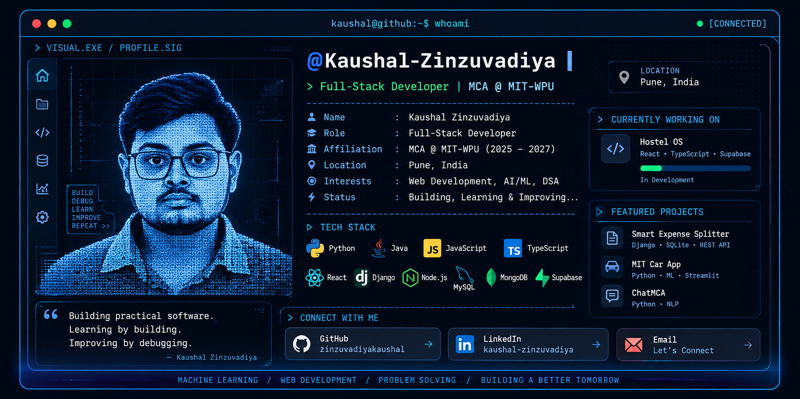

<!-- ========================================================= -->

<!--                  KAUSHAL AGENT CONSOLE                     -->

<!-- ========================================================= -->

  

<!-- ========================================================= -->

<!--                         INTRO                              -->

<!-- ========================================================= -->

👋 Hey, I'm Kaushal

Full-Stack Developer · Python & Java · React & Django · AI/ML Enthusiast

Building practical software. Learning by building. Improving by debugging.

 

 

🧑‍💻 About Me

<table width="100%">
<tr>

<td width="62%" valign="top">

I'm Kaushal Zinzuvadiya, an MCA student at MIT World Peace University (MIT-WPU), Pune, currently pursuing my MCA from 2025–2027.

I'm interested in building practical software using Python, Java, JavaScript, TypeScript, React, Django, REST APIs, and databases.

I enjoy working across the development process — from designing interfaces and backend logic to working with APIs, databases, testing, debugging, and improving applications.

I'm also exploring AI/ML and intelligent software applications while strengthening my Computer Science fundamentals.

</td>

<td width="38%" valign="top">

🎓 Education

MCA @ MIT-WPU
2025–2027

💻 Focus

Full-Stack Development
Backend Development
Python & Java

🧠 Foundations

DSA
OOP
DBMS
Problem Solving

🤖 Exploring

AI / ML

</td>

</tr>
</table>

⚡ What I Build

<table width="100%">
<tr>

<td width="25%" align="center" valign="top">

🌐

FULL-STACK

Frontend
Backend
Database

</td>

<td width="25%" align="center" valign="top">

⚙️

BACKEND

Python
Django
Java
REST APIs

</td>

<td width="25%" align="center" valign="top">

🧠

ENGINEERING

DSA
OOP
DBMS
Debugging

</td>

<td width="25%" align="center" valign="top">

🤖

AI / ML

Machine Learning
Intelligent Apps
Exploration

</td>

</tr>
</table>

🛠️ Technical Arsenal

💻 Languages

  

🎨 Frontend

  

⚙️ Backend

  

🗄️ Databases

  

🔧 Tools

  

OOP · DSA · DBMS · REST APIs · Debugging · Problem Solving

🚀 Featured Project

<table width="100%">
<tr>

<td width="68%" valign="top">

💰 Smart Expense Splitter

A Django-based web application for managing group expenses, participants, and shared balances.

🧩 What It Includes

User registration and authentication

Expense group management

Participant management

Categorized expense tracking

Automatic balance calculation

REST API endpoints

Django administration

Responsive web interface

Testing and debugging

🛠️ Technology

Python Django SQLite
REST API Bootstrap HTML CSS

 

</td>

<td width="32%" align="center" valign="middle">

  

Python

Django

SQLite

REST API

Bootstrap

</td>

</tr>
</table>

📦 Other Projects

<table width="100%">
<tr>

<td width="50%" valign="top">

🏠 Hostel OS

A full-stack hostel management application focused on administrative workflows and student data handling.

Technology

React TypeScript Supabase

Status

🟡 Active Development

</td>

<td width="50%" valign="top">

🚗 MIT Car App

A machine-learning-powered car price prediction web application with an interactive interface.

Technology

Python Machine Learning Streamlit

</td>

</tr>

<tr>

<td width="50%" valign="top">

💬 ChatMCA

A conversational application exploring interactive dialogue systems and NLP concepts.

Technology

Python NLP

</td>

<td width="50%" align="center" valign="middle">

💡 IDEA

↓

💻 BUILD

↓

🐛 DEBUG

↓

🚀 IMPROVE

</td>

</tr>
</table>

🔨 Currently Building

<table width="85%">
<tr>

<td width="22%" align="center">

🏠

</td>

<td width="78%" valign="middle">

Hostel OS

A full-stack hostel management system currently being developed with:

React · TypeScript · Supabase

Focused on practical hostel-related workflows, application development, database integration, and testing.

🚧 ACTIVE DEVELOPMENT

</td>

</tr>
</table>

🧠 Development Loop

<table width="100%">
<tr>

<td align="center">💡 <b>IDEA</b></td>
<td align="center">→</td>
<td align="center">🔍 <b>UNDERSTAND</b></td>
<td align="center">→</td>
<td align="center">🏗️ <b>DESIGN</b></td>
<td align="center">→</td>
<td align="center">💻 <b>BUILD</b></td>
<td align="center">→</td>
<td align="center">🧪 <b>TEST</b></td>
<td align="center">→</td>
<td align="center">🐛 <b>DEBUG</b></td>
<td align="center">→</td>
<td align="center">🚀 <b>IMPROVE</b></td>

</tr>
</table>

 

Build → Test → Debug → Learn → Improve

🏆 Milestones

<table width="100%">

<tr>
<td width="8%" align="center">🏆</td>
<td width="27%"><b>Smart India Hackathon 2025</b></td>
<td>Participated in the MIT-WPU University Internal Round and progressed to the Second Round.</td>
</tr>

<tr>
<td align="center">⚡</td>
<td><b>X-FAIR Hackathon</b></td>
<td>Participated as part of a developer team representing MIT-WPU.</td>
</tr>

<tr>
<td align="center">📄</td>
<td><b>Academic Research</b></td>
<td>Co-authored research on Social Media Usage and Student Productivity.</td>
</tr>

<tr>
<td align="center">🌐</td>
<td><b>Cisco Networking Academy</b></td>
<td>Successfully completed the Networking Basics course.</td>
</tr>

</table>

📚 Currently Learning

<table width="100%">
<tr>

<td align="center" width="20%">🌐 <b>WEB</b> Advanced Web Architecture</td>
<td align="center" width="20%">⚙️ <b>BACKEND</b> REST APIs & Services</td>
<td align="center" width="20%">🧠 <b>DSA</b> Problem Solving</td>
<td align="center" width="20%">🤖 <b>AI / ML</b> Intelligent Applications</td>
<td align="center" width="20%">🏗️ <b>ENGINEERING</b> Best Practices</td>

</tr>
</table>

👨‍💻 Developer Reality Check

def write_code():
    try:
        build_feature()
        print("Build Successful! Works on first try!")

    except Exception:
        debug_for_hours()

    finally:
        question_everything(
            "Wait... why did it work without throwing a single error?"
        )

📊 GitHub Analytics

<table width="100%">
<tr>

<td width="50%" align="center" valign="top">

</td>

<td width="50%" align="center" valign="top">

</td>

</tr>
</table>

 

  

🎯 Current Focus

<table width="90%">
<tr>

<td align="center" width="20%">🌐 <b>FULL-STACK</b> Building Web Applications</td>
<td align="center" width="20%">⚙️ <b>BACKEND</b> Python · Java · REST APIs</td>
<td align="center" width="20%">🗄️ <b>DATABASES</b> SQL · NoSQL · Backend Data</td>
<td align="center" width="20%">🧠 <b>PROBLEM SOLVING</b> DSA · OOP · DBMS</td>
<td align="center" width="20%">🤖 <b>AI / ML</b> Exploring Intelligent Apps</td>

</tr>
</table>

 

Learn → Build → Test → Debug → Improve

🤝 Let's Connect

I'm always open to connecting with developers, students, recruiters, and people interested in technology.

  

  

  

🚀 Build. Learn. Debug. Improve.

One meaningful project at a time.

 

